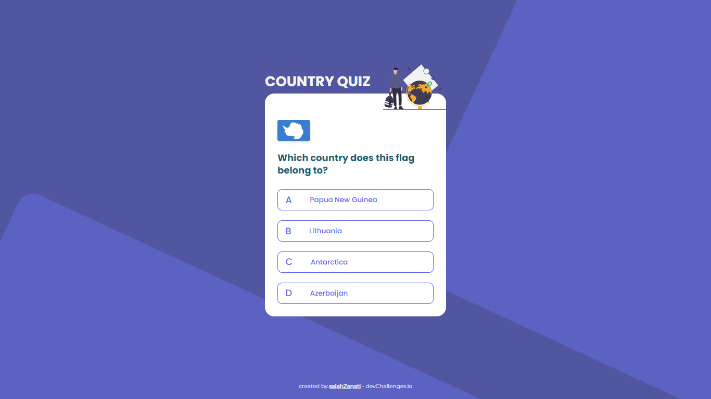

<h1 align="center">Country Quiz</h1>

<div align="center">
   Solution for a challenge from  <a href="http://devchallenges.io" target="_blank">Devchallenges.io</a>.
</div>

<div align="center">
  <h3>
    <a href="https://salah-zanati.github.io/country-quiz-master">
      Demo
    </a>
    <span> | </span>
    <a href="https://github.com/Salah-Zanati/country-quiz-master">
      Solution
    </a>
    <span> | </span>
    <a href="https://legacy.devchallenges.io/challenges/Bu3G2irnaXmfwQ8sZkw8">
      Challenge
    </a>
  </h3>
</div>

<!-- TABLE OF CONTENTS -->

## Table of Contents

- [Overview](#overview)
  - [Built With](#built-with)
- [How to use](#how-to-use)
- [Contact](#contact)

## Overview



### Built With

- [React](https://reactjs.org/)
- [Tailwind](https://tailwindcss.com/)
- [Apollo GraphQL](https://www.apollographql.com/)
- [Material UI](https://mui.com/)

## How To Use

To clone and run this application, you'll need [Git](https://git-scm.com) and [Node.js](https://nodejs.org/en/download/) (which comes with [npm](http://npmjs.com)) installed on your computer. From your command line:

```bash
# Clone this repository
$ git clone https://github.com/Salah-Zanati/country-quiz-master.git

# Install dependencies
$ npm install

# Run the app
$ npm run dev
```

## Contact

- Website [salahzanati.web.app](http://salahzanati.web.app)
- GitHub [Salah-Zanati](https://github.com/Salah-Zanati)
- Linkedin [Salah Zanati](https://www.linkedin.com/in/salah-zanati-419a1024a)
